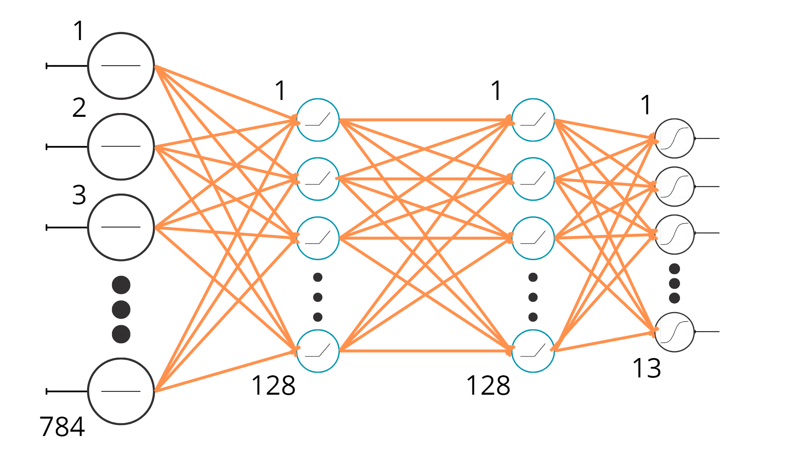
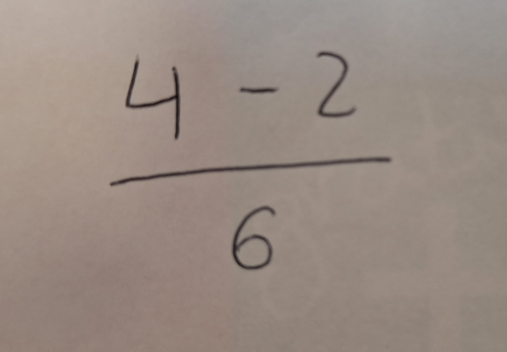
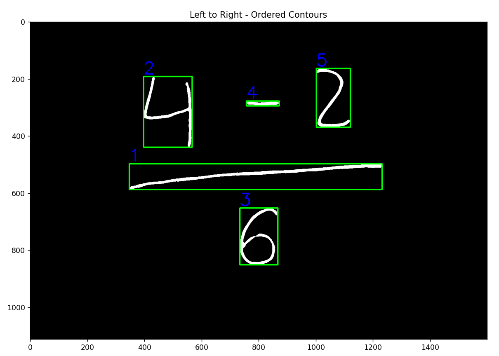
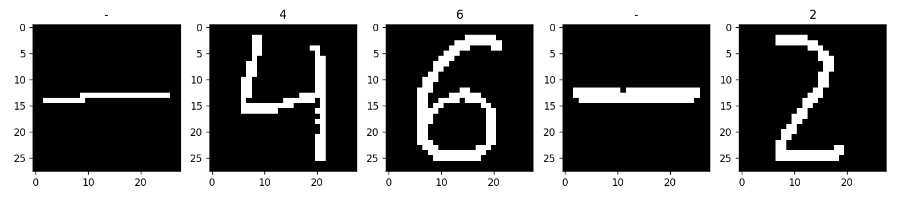

# VisionMath
AI-Powered simple mathematical expression solver

## Description
VisionMath takes a handwritten mathematical operation and uses AI to recognize the characters. 
Afterward, it builds the operation and returns the corresponding value.

## Installation
VisionMath was made on **Python 3.11** and the packages it requires are:

* *OpenCV*
* *Numpy*
* *Matplotlib*
* *Keras*
* *Scipy*

Once everything is installed, just add your image to the `testingImages` folder and run `visionmath.py`

## Keras Model
VisionMath uses a `Tensorflow Keras` model formed by:
1. Flatten Layer (input_shape = (28,28))
2. Dense Layer (units = 128, activation = relu)
3. Dense Layer (units = 128, activation = relu)
4. Dense Layer (units = 13, activation = softmax)

## Tests

### Input image

### Left-Right ordered contours image

### Model classification

### Expression evaluation

EXPRESSION: ((4-2)/(6)) 

RESULT: 0.33 

